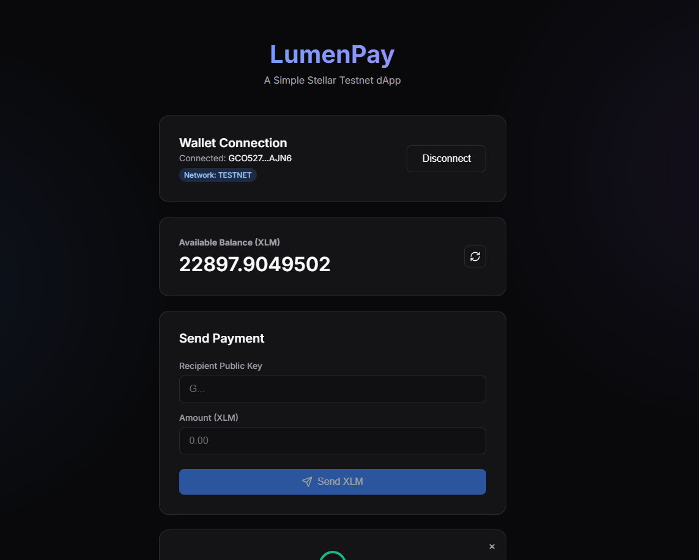
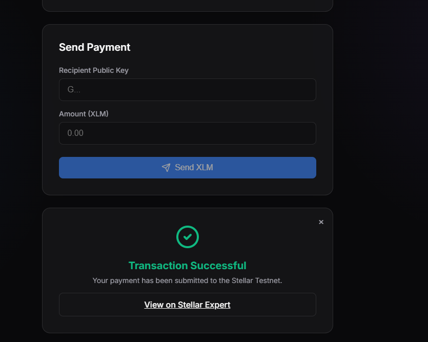
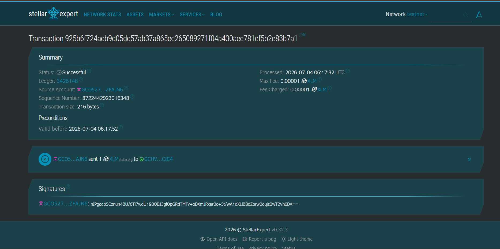

# Simple Payment dApp (LumenPay)

A complete, production-ready Stellar Testnet decentralized application (dApp) for connecting your Freighter wallet, checking your XLM balance, and sending payments across the Stellar Testnet. 

**Note: This application is strictly built for the Stellar TESTNET. Do not use Mainnet accounts or real funds.**

## 🚀 Features

- **Freighter Wallet Integration**: Connect and disconnect your Stellar wallet securely using the Freighter extension.
- **Real-time Balance**: Fetches and displays your live Testnet XLM balance directly from the Horizon server.
- **Send Payments**: Build, sign, and submit real Stellar payment transactions to the Testnet.
- **Robust Error Handling**: Real feedback for insufficient funds, missing accounts, and transaction failures.

## 🛠 Tech Stack

- **Frontend Framework**: React (Vite) + TypeScript
- **Stellar SDK**: `@stellar/stellar-sdk` for Horizon interaction and transaction building
- **Freighter API**: `@stellar/freighter-api` for secure wallet connection and transaction signing
- **Styling**: Vanilla CSS with a modern dark theme and glassmorphism aesthetics
- **Icons**: `lucide-react`

## 📋 Prerequisites

1. **Node.js** (v18+ recommended)
2. **Freighter Wallet Extension** installed in your browser ([freighter.app](https://freighter.app/)).
3. A **Stellar Testnet Account** funded with XLM. You can fund a new account using [Friendbot](https://friendbot.stellar.org/).

## 💻 Local Setup Instructions

1. **Clone the repository** (if applicable) or navigate to the project folder:
   ```bash
   cd LumenPay
   ```

2. **Install dependencies**:
   ```bash
   npm install
   ```

3. **Environment Variables**:
   The project includes a `.env.example`. Create a `.env` file in the root directory (or use the one already provided):
   ```env
   VITE_HORIZON_URL=https://horizon-testnet.stellar.org
   VITE_NETWORK_PASSPHRASE=Test SDF Network ; September 2015
   ```

4. **Run the Development Server**:
   ```bash
   npm run dev
   ```
   Open `http://localhost:5173` in your browser.

## 📖 How to Use the App

1. **Connect Wallet**: Make sure your Freighter extension is set to "Testnet". Click the **"Connect Wallet"** button and approve the connection in Freighter.
2. **View Balance**: Once connected, your public key and real XLM balance will be fetched from Horizon and displayed automatically.
3. **Send Payment**: 
   - Enter a valid Testnet recipient public key.
   - Enter the amount of XLM to send.
   - Click **"Send XLM"** and sign the transaction in the Freighter popup.
4. **View Result**: Upon success, a confirmation will appear with a link to view your real transaction on Stellar Expert.

## 📸 Screenshots

**Wallet Connected State**

*Description: Shows the UI after the Freighter wallet is successfully connected.*

**Balance Displayed**

*Description: Shows the live XLM balance fetched from the Testnet Horizon server.*

**Successful Testnet Transaction**


*Description: Shows the success state with the transaction hash and a link to Stellar Expert.*

## 📄 License

This project is licensed under the MIT License.
